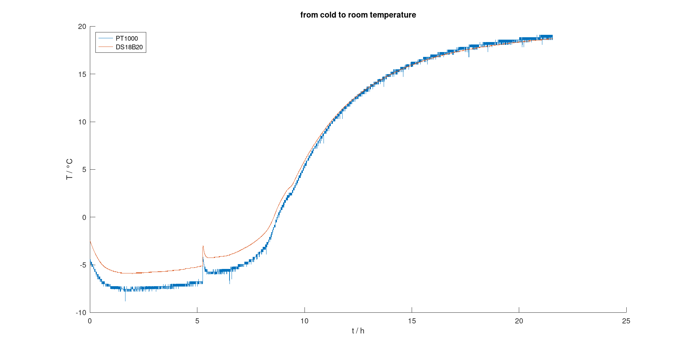

# Testing, Measurements & Results
## Setup
In the test setup I make use of [DS18B20 sensor board](https://github.com/LMWB/Quattro-Formaggi) as a reference temperature.
The DS18B20 is a well documented digital temperature sensor.
Since it is factory calibrated, I can assume it's measurements are exact (in terms of consumer market quality).
So I use the results of the DS18B20 to estimate how good my measurement bridge is working. 

I than use a rubber band to attache one DS18B20 to one PT1000 sensor. I did this twice. On pair is going to do a *hot to room temperature test*. The other pair is doing a *cold to room temperature test*. I use a metal small pitcher filled with hot water from the kettle. And I use thermal pack from the freezer. Both gets equipped with one pair of temperature sensors.

## Execution
To start the testing scene I only had to plug in the two Nucleo boards to my computer and start a serial terminal to log the outputs to console.
I used CuteCom. The firmware of each Nucleo board prints the temperature conversion results to serial monitor with 5000ms period (f=0.2Hz).
Total record time is T = N/f = 15540/0.2Hz = 77700 sec = 21h:30min.

## Interpretation
Study the plots two things are to mention: 
- the measurement bridge (blue line) is much noisy 
- red line and blue line are quit identical except below zero degrees Celsius

The glitch in the cold record at around 3800 ms is due to my impatience.
I lifted the thermal pack to feel the cold with my hand.
At least I could verify that both type of sensors a quick in response :).




- to smooth the measurements I added a moving-average filter in Octave
- recap the schematics and the simulation done there it is clear, that this circuit is not gonna work for temperatures below zero, so the behavior is quit as expected
- to measure temperatures below zero the OPAMP must be provided with negative supply voltage or the output range must be set to cover some degrees below zero (map to positve) with some drawback of resolution on the ADC

## Error


- error below zero degrees (from 0h to around 11h in time domain) is insane, but not relevant (see discussion above)
- from 10 degrees and up its very acceptable for such a primitive schematics
- the PCB fabricated so far does not have a voltage reference of 5V instead using the Nucleo onboard LDO which does not provide a stable 5V
- instead its around 4,75V
- fixing this issue will increase performance and systematic error

Perhaps the reade noticed the asymptote at x=8.7h. General formula to relative error calculation

```math
err = \frac{|y_{true}-y|}{y}
```
But what if y is zero? I mean 0 as a true value.
In my case zero degrees, which is a correct measurement.
The error goes wild since its been divided by zero. 
Does anybody know how to tread this situation in terms of correct subject to math / physics?

## Conclusions
- performance is good and as aspect from simulations
- BOM has less, uncomplicated and cheap components
- add some sort of digital low pass filter in C-code
- add reference voltage and do measurements again